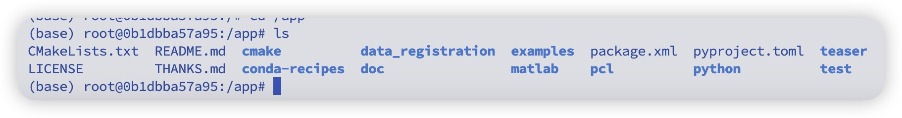
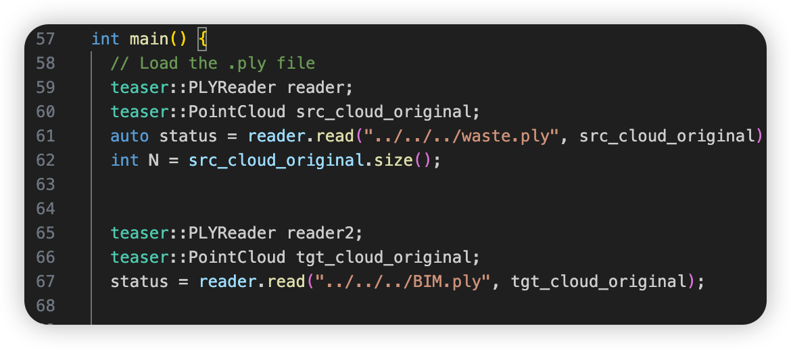

# Teaser++

## 原始github仓库:
https://github.com/MIT-SPARK/TEASER-plusplus

## 以下是打包的环境和代码以及复现步骤

### docker镜像下载地址

通过网盘分享的文件：teaserpp_dockerimage.tar
链接: https://pan.baidu.com/s/1K2inNvFQcajOQZM8M7XbjA


### 代码下载
通过网盘分享的文件：teaserpp-code.zip
链接: https://pan.baidu.com/s/1LafNxmlViU2mf-dGlZeiYQ

### 操作步骤
- 解压代码压缩包 teaser-code.zip 
- 导入docker镜像 docker load < teaserpp_dockerimage.tar，teaserpp_dockerimage.tar是刚才下载的docker 镜像
- 启动docker镜像，将代码包根目录映射到docker 容器的 /app目录
命令如下：
`docker run -it -v ./:/app teaserpp:latest /bin/bash`
- 此时已进入docker，进入app目录

- 输入两个ply进行配准的代码位于examples/teaser_cpp_fpfh_ply/teaser_cpp_fpfh.cc，进入该目录打开文件，图中61行、67行可更改ply路径

将待配准文件放入代码目录，并更改此处代码即可。
- 运行：
在teaser_cpp_fpfh_ply下新建build文件夹，
cd build
cmake ..
make 
稍等片刻程序编译成功，即可运行程序。

运行示例如下：
```


 root@0b1dbba57a95:/app/examples/teaser_cpp_fpfh_ply/build# ./teaser_cpp_fpfh 
        Read 16814134 total vertices 
        Read 26377700 total vertices 
正在对源点云进行下采样 (leaf_size: 0.2)...
下采样后源点云剩余 67893 个点。
正在对目标点云进行下采样 (leaf_size: 0.2)...
下采样后目标点云剩余 139545 个点。
正在保存下采样后的源点云到: downsampled_source.ply
正在保存下采样后的目标点云到: downsampled_target.ply
正在计算FPFH特征 (法线半径: 0.5, FPFH半径: 1.5)...
FPFH特征计算完毕。
源点云描述子数量: 67893
目标点云描述子数量: 139545
正在匹配特征 (使用相互对应检查: 是)...
CROSS CHECK
Skipping Tuple Constraint.
找到 5006 个初始对应点对。
开始使用 TEASER++ 进行配准...
Starting scale solver (only selecting inliers if scale estimation has been disabled).
Scale estimation complete.
Max core number: 596
Num vertices: 5007
Max Clique of scale estimation inliers: 
Using chain graph for GNC rotation.
Starting rotation solver.
GNC rotation estimation noise bound:3
GNC rotation estimation noise bound squared:9
GNC-TLS solver terminated due to cost convergence.
Cost diff: 0
Iterations: 17
Rotation estimation complete.
Starting translation solver.
Translation estimation complete.
=====================================
          TEASER++ Results           
=====================================
Estimated rotation: 
    0.76842    0.636905  -0.0623118
  -0.638254    0.769823 -0.00229025
  0.0465104   0.0415306    0.998054

Estimated translation: 
 -24.758
-15.3512
0.786257

正在变换下采样后的源点云...
正在保存变换后的源点云到: transformed_source_registered.ply
正在变换原始的源点云...
正在保存变换后的(原始)源点云到: transformed_source_original_registered.ply

配准完成。你可以比较以下文件：
1. 变换后的(下采样)源点云: transformed_source_registered.ply
2. 变换后的(原始)源点云: transformed_source_original_registered.ply
(也可以查看原始下采样版本: downsampled_target.ply 和 downsampled_source.ply)

初始对应点对数量: 5006
Time taken (s): 1.05065
=====================================
```