## List of Common 3D Test Models

| Model Name | Image | Model Name | Image |
|------------|-------|------------|-------|
| Armadillo | 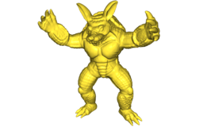 | Beast | 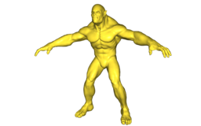 |
| Beetle | 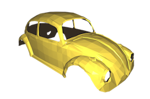 | Cheburashka | 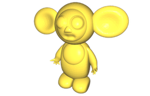 |
| Cow | 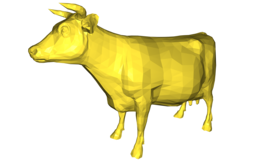 | Fandisk |  |
| Happy Buddha | 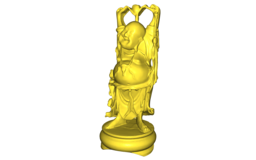 | Horse | 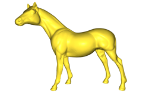 |
| Max Planck | 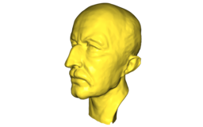 | Nefertiti | 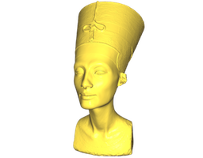 |
| Ogre | 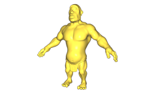 | Rocker Arm | 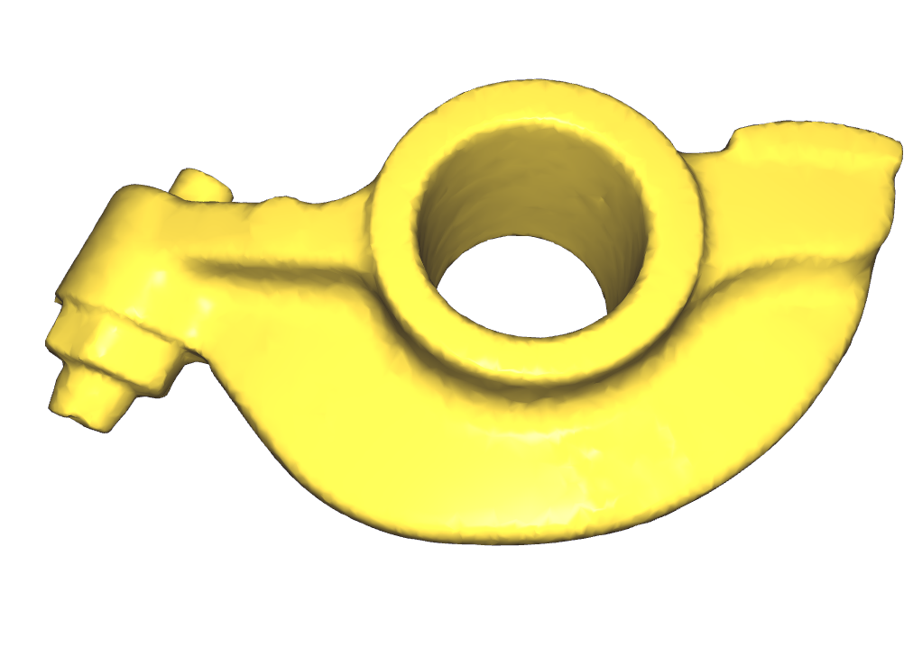 |
| Spot | 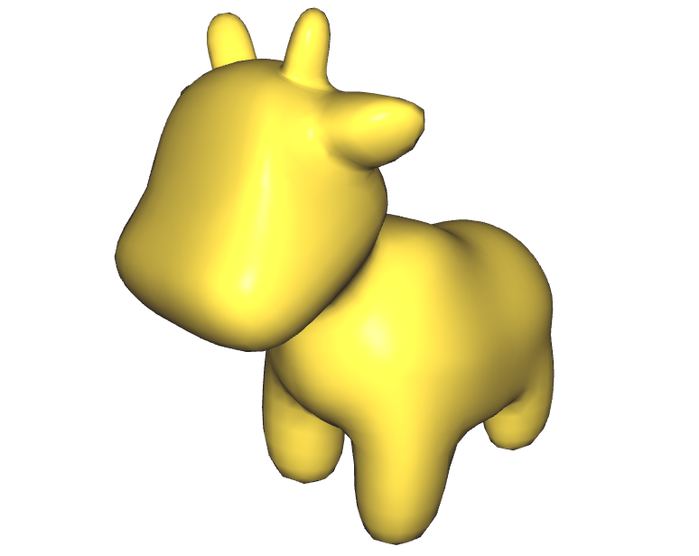 | Stanford Bunny | 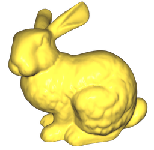 |
| Suzanne | 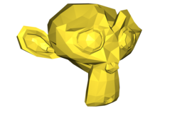 | Teapot | 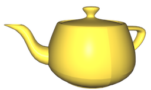 |
| XYZ Dragon |  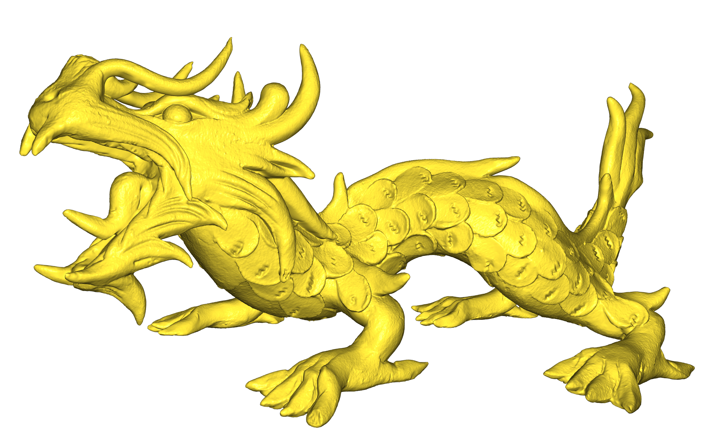  | Alligator |  |
| Woody/Gingerbread Man | 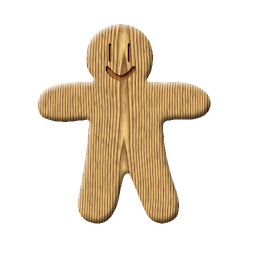 | Lucy | 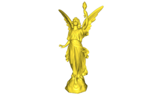  | 
| Bimba | 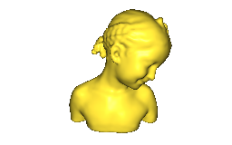 | Igea | 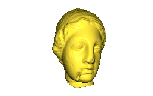 |
| Homer | 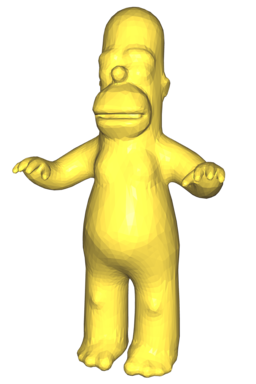 |  |   |

# Other lists and repositories of 3D models

- [List](https://all3dp.com/best-sites-free-stl-files-3d-printing/) of websites offering collections of 3D models.
- [Thingiverse](http://www.thingiverse.com/)
- [thingi10k](https://ten-thousand-models.appspot.com)
- [GrabCAD](https://grabcad.com/library)
- [The Stanford 3D Scanning Repository](http://graphics.stanford.edu/data/3Dscanrep/)
- [Large Geometric Models Archive (Georgia Tech)](https://www.cc.gatech.edu/projects/large_models/)
- [Keenan's 3D Model Repository](http://www.cs.cmu.edu/~kmcrane/Projects/ModelRepository/)
- [McGuire Computer Graphics Archive](http://casual-effects.com/data/index.html)
- [3D Scans of Statues and Crabs](http://threedscans.com/)
- [3D Model Haven](https://3dmodelhaven.com/models/)
- [A Large Dataset of Object Scans](http://redwood-data.org/3dscan/index.html)
- [CAD Model Datasets](http://edge.cs.drexel.edu/repository/)
- https://www.shapenet.org/
- http://modelnet.cs.princeton.edu/
- https://www.themantissa.net/resources/
- https://archive3d.net/
- [Aim@Shape](http://visionair.ge.imati.cnr.it/ontologies/shapes/viewmodels.jsp)
- [Rendering Resources](https://benedikt-bitterli.me/resources/)
- [Human 3D Scans](https://ps.is.tuebingen.mpg.de/research_projects/faust-dataset)
- [USTC 20712 Dataset for Parameterizations](http://staff.ustc.edu.cn/~fuxm/projects/ProgressivePara/dataset.html)
- [USTC 5181 meshes](http://staff.ustc.edu.cn/~fuxm/projects/AHSP/index.html)
- [MPI Dynamic FAUST human bodies](http://dfaust.is.tue.mpg.de/)
 - [Facebook Reality Lab Replica](https://github.com/facebookresearch/Replica-Dataset)
- [Smithsonian Institution](https://www.si.edu/search/3d-models)
- [3D scans by artec](https://www.artec3d.com/3d-models)
- [Malopolska Museum heritage objects](https://sketchfab.com/WirtualneMuzeaMalopolski)
- [threedscans.com](http://threedscans.com/)
- [Statue Model Repository](https://lgg.epfl.ch/statues_dataset.php)
- [Real World Textured Things (RWTT)](https://texturedmesh.isti.cnr.it)
- [Scan the World initiative](https://www.myminifactory.com/category/scan-the-world)
- [Objaverse: A Universe of Annotated 3D Objects](https://objaverse.allenai.org/)
